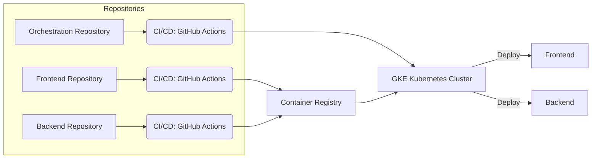

# Face Recognition Application Deployment with CI/CD

We want to develop a cloud-based application consisting of two services:  
1. The backend API implemented in Python using FastAPI, which offers facial recognition capabilities.  
2. The frontend built with Kotlin using Ktor, which provides a simple web interface to upload images and display the recognition results.  

The focus of the project is on utilizing cloud computing tools like containerization and automated deployment pipelines.

## Technology Stack

- **Backend**: Python with FastAPI for face recognition  
- **Frontend**: Kotlin with Ktor for web interface  
- **Containerization**: Docker  
- **Orchestration**: Kubernetes with Google Kubernetes Engine (GKE)  
- **CI/CD**: GitHub Actions  
## Architecture Diagram

## Tasks

### Frontend Service (Tim)
- Implement a simple web interface using Kotlin and Ktor.
- Use Github Actions to automate the CI/CD pipeline. 
- - Build container image using the `Dockerfile`. 
- - Push the container image to a container registry.

### Backend Service (Anna)
- Implement a RESTful API using Python and FastAPI.
- Use Github Actions to automate the CI/CD pipeline.
- - Build container image using the `Dockerfile`.
- - Push the container image to a container registry.

### Kubernetes Deployment (Andi)
The Kubernetes cluster is configured to deploy and manage the services using the provided YAML files:

- Create a Kubernetes deployment for the frontend service.
- Create a Kubernetes deployment for the backend service.
- Create a Kubernetes service for the frontend and backend services.
- Use Github Actions to apply the Kubernetes manifests to the cluster.
- - Apply the deployment manifests.
- - **Frontend** and **Backend** are deployed as separate microservices.
- The cluster runs on **Google Kubernetes Engine (GKE)**.

## Demonstration

- **Deployment Workflow**:  
  - Triggered by code changes via GitHub Actions.  
  - New images are built, pushed to a container registry, and deployed to the Kubernetes cluster.  
- **Kubernetes Overview**:  
  - Showcase running pods, nodes, and container orchestration.  
- **CI/CD Showcase**:  
  - Highlight GitHub Actions workflow configuration and execution.  
- **Application Demo**:  
  - Upload an image through the frontend.  
  - Display face recognition results processed by the backend.  

## Team Members

- Tim Lohninger, K12141837  
- Andreas Hofstadler, K12224237  
- Anna Kurzecka, K11939589  
