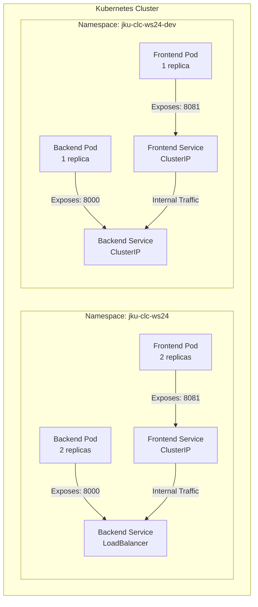
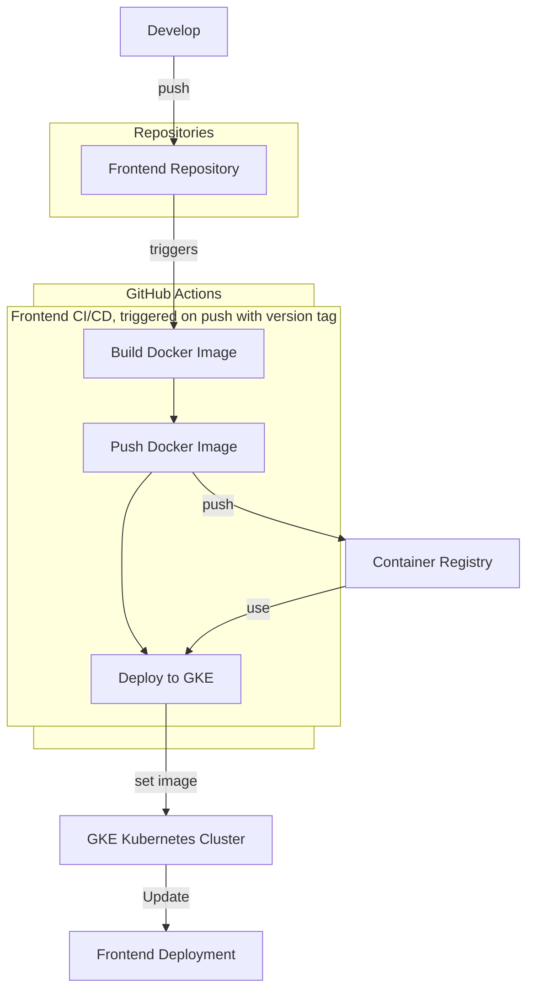

# Face Recognition Application Deployment with CI/CD


A simple face recognition application that allows users to upload images and receive recognition results. The application consists of two components:
1. The backend API implemented in Python using FastAPI, which offers facial recognition capabilities.
2. The frontend built with Kotlin using Ktor, which provides a simple web interface to upload images and display the recognition results.


## Kubernetes
Below is the architecture diagram illustrating the deployment in Kubernetes:




### Deployment Overview

#### Namespaces
Two namespaces are used for the deployment: `jku-clc-ws24` for production and `jku-clc-ws24-dev` for development. The production namespace is used for the final deployment, while the development namespace is used for testing purposes.


#### Frontend Deployment
The frontend component runs two replicas of the `andih82/jku-clc-ws24-frontend` Docker image. It exposes port `8081` and communicates with the backend service using the environment variables `API_IP` and `API_PORT`.
The two replicals allow a Rolling Update strategy to be used for deployments with no downtime.

In the development namespace, the frontend component runs only one replica, which is sufficient for testing purposes.

#### Backend Deployment
The backend component runs two replicas of the `andih82/jku-clc-ws24-backend` Docker image. It exposes port `8000` and is used by the frontend service to perform facial recognition.
The two replicals allow a Rolling Update strategy to be used for deployments with no downtime.

In the development namespace, the backend component runs only one replica, which is sufficient for testing purposes.


### Services

#### Frontend Service
The frontend service exposes the frontend application on port `8081` within the cluster. It uses a `ClusterIP` type.
For development, the frontend service is configured with a `ClusterIP` type.
We decided to use a ClusterIP, to avoid exposing the frontend to the public and for Demo purposes we can use port-forwarding to access the frontend.


#### Backend Service
The backend service exposes the backend application on port `8001` and is configured as a `LoadBalancer` with an internal load balancer.
For development, the backend service is configured with a `ClusterIP` type, there is only one replica running in the development namespace, so no need for a load balancer.

### How to Deploy initially

1. Apply the namespace configuration:
   ```sh
   kubectl apply -f namespace.yaml
   ```

2. Deploy the frontend:
   ```sh
   kubectl apply -f frontend-deployment.yaml
   ```

3. Deploy the backend:
   ```sh
   kubectl apply -f backend-deployment.yaml
   ```

4. Apply the services:
   ```sh
   kubectl apply -f frontend-service.yaml
   kubectl apply -f backend-service.yaml
   ```
5. Access the frontend service using port-forwarding:
   ```sh
   kubectl port-forward svc/frontend-service 8080:8081 -n jku-clc-ws24
   ```
6. Access the frontend in your browser at `http://localhost:8080/upload`.

### Notes
- Free autocluster has limited resources, so the production deployment is limited to two replicas. Usually the backend service would have more replicas to handle the load and resource heavy task.
- For the development deployment, only one replica is used for each component to save resources. Downtime is acceptable for development purposes.
- The deployment needs readiness and liveness probes to ensure the application is running correctly.
- The frontend can be exposed using an Ingress controller for production deployments.
- The deployment can be extended with a database to store recognition results.

## CI/CD Pipeline
The CI/CD pipeline is implemented using GitHub Actions. The pipeline consists of the following stages:
The backend and frontend repositories are configured with GitHub Actions to trigger the pipeline on push events with version tag. The pipeline builds the Docker images, pushes them to the Google Container Registry, and deploys them to the GKE cluster. The deployment is updated with the new image, ensuring the latest version is running in the cluster.


### Frontend CI/CD Pipeline
1. Build: Builds the Docker images for the frontend and backend components.
2. Push: Pushes the Docker images to the Google Container Registry.
3. Deploy: Deploys the images to the Google Kubernetes Engine (GKE) cluster.
4. Update: Updates the deployment (pods) with the new image

For development, the pipeline is triggered on push events to the `develop` branch. The pipeline builds the Docker images, pushes them to the Google Container Registry, and deploys them to the GKE cluster. The deployment is updated with the new image, ensuring the latest version is running in the cluster.

### Actions
```yaml
name: Frontend CI/CD main

on:
push:
tags:
- 'v*.*.*'  # only when there are version tags like v1.0.1

env:
REGISTRY: ghcr.io
IMAGE_NAME: ${{ github.repository }}
PROJECT_ID: ${{ secrets.GKE_PROJECT }}
GAR_LOCATION: 'europe-central2'
GKE_CLUSTER: 'autopilot-cluster-1'
GKE_ZONE: 'europe-central2'
WORKLOAD_IDENTITY_PROVIDER: 'projects/375220123351/locations/global/workloadIdentityPools/github/providers/my-repo'


jobs:
build-and-push:
runs-on: ubuntu-latest
permissions:
contents: 'read'
packages: 'write'
id-token: 'write'

    steps:
      # Check repository
      - name: Checkout repository
        uses: actions/checkout@v4

      - id: 'auth'
        name: 'Authenticate to Google Cloud'
        uses: 'google-github-actions/auth@v2'
        with:
          workload_identity_provider: '${{ env.WORKLOAD_IDENTITY_PROVIDER }}'

      # Fetch all tags and get the latest tag or fall back to a default version
      - name: Get latest tag or fallback
        id: version
        shell: bash
        run: |
          git fetch --tags
          
          # Get the latest tag from git, defaulting to v0.0.0 if no tags are found
          latest_tag=$(git tag -l --sort=-creatordate | head -n 1 || echo "v0.0.0")
          
          echo "version=${latest_tag#v}" >> $GITHUB_OUTPUT

      # Set up Docker
      - name: Set up Docker Buildx
        uses: docker/setup-buildx-action@v3

      # Log in to GitHub Container Registry
      - name: Log in to GitHub Container Registry
        uses: docker/login-action@v3
        with:
          registry: ${{ env.REGISTRY }}
          username: ${{ github.actor }}
          password: ${{ secrets.GITHUB_TOKEN }}

      # Build and push Docker image
      - name: Build and push Docker image
        uses: docker/build-push-action@v5
        with:
          context: .
          push: true
          tags: |
            ${{ env.REGISTRY }}/${{ env.IMAGE_NAME }}:latest
            ${{ env.REGISTRY }}/${{ env.IMAGE_NAME }}:${{ steps.version.outputs.version }}
          cache-from: type=gha
          cache-to: type=gha,mode=max

      # Get the GKE credentials so we can deploy to the cluster
      - name: 'Set up GKE credentials'
        uses: 'google-github-actions/get-gke-credentials@v2'
        with:
          project_id: ${{ secrets.GKE_PROJECT }}
          cluster_name: '${{ env.GKE_CLUSTER }}'
          location: '${{ env.GKE_ZONE }}'

      # Deploy the Docker image to the GKE cluster
      - name: 'Deploy to GKE'
        run: |-
          kubectl config set-context --current --namespace=jku-clc-ws24
          kubectl get pods
          kubectl set image deployment/jku-clc-ws24-frontend jku-clc-ws24-frontend=ghcr.io/andih82/jku-clc-ws24-frontend:${{ steps.version.outputs.version }}
          kubectl get pods
```

### Backend CI/CD Pipeline
Is configured in the same way as the frontend pipeline, but with different Docker images and deployment configurations.

### Development Pipelines
Are configured the same way as the main pipelines, but are triggered on push events to the `development` branch and pull requests to main branch.

```yaml
name: Frontend CI/CD Development

on:
  push:
    branches:
      - development
  pull_request:
    branches:
      - master
```

### Notes
- The pipline, both in Frontent and Backend, includes already simple tests. Tests should be extended to cover all critical aspects of the application before deployment.
- The pipeline can be extended with manual approval steps for production deployments.
- The versioning of the Docker images is done using the Git tag, which is automatically created when a new version is pushed to the repository.
- A rollback strategy should be implemented in case the deployment fails.
- Relase tasks could be added to the pipeline to notify users of new deployments.

## Lessons Learned
- Kubernetes is a powerful tool for deploying and managing containerized applications.
- CI/CD pipelines automate the deployment process and ensure consistency across environments.
  - Difficulties in setting up the pipeline, especially with the GKE cluster and permissions.
  - Deiciding on the right deployment strategy for the application, is not so easy.
- Authentication and authorization are important aspects of securing the deployment and can be tricky to configure.
- Plattform engeneering is a complex field that requires knowledge in many areas, such as networking, security, and continuous integration and deploment strategies.
